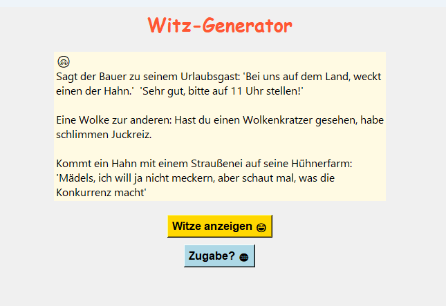

# 🤣 Witz-Generator – Lach mal wieder!

Ein kleiner, fröhlicher Witz-Generator mit zwei Quellen:
- **Pyjokes**: lokale Entwicklerwitze auf Deutsch
- **WitzAPI.de**: frische Online-Witze per API

## 🧩 Funktionen
- Zufällige Witze mit wechselnden Farben und Emojis
- Zwei Buttons: „Witze anzeigen 😄“ und „Zugabe? 🌐“
- Zwei Witzquellen – lokal installiert und live aus dem Netz (WLAN nötig)
- Kompakte, freundliche Oberfläche mit `tkinter`

## 🚀 Installation
1. Python installieren (ab Version 3.10 empfohlen)
2. Benötigte Pakete installieren:

```bash
pip install pyjokes requests
```
3. App starten:

```
python witz_app.py
```



## ❤️ Idee & Umsetzung

Ein Projekt aus Spaß am Code – für mehr Lachen im Alltag.

## 👩‍💻 Autor

Erstellt von Serena – mit viel Lernfreude 😄

## 📄 Lizenz


Dieses Projekt kann frei verwendet und angepasst werden – für Lernzwecke, Spaß und persönliche Weiterentwicklung.
